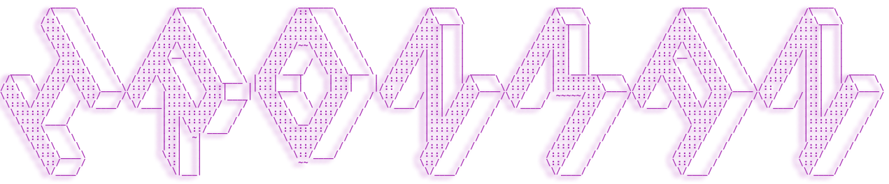

<a href="https://www.codewars.com/users/SebastianTerleira">
 
</a>

<h1 align="center">
  
</h1>

## 🔥 𝙎𝙩𝙧𝙚𝙖𝙠 𝙨𝙩𝙖𝙩𝙨

<!-- GitHub Readme Streak Stats - https://github.com/SebastianTerleira/github-readme-streak-stats -->

  

<!-- Some badges are from https://github.com/Ileriayo/markdown-badges -->

## 🛠️ 𝙈𝙮 𝙛𝙖𝙫𝙤𝙧𝙞𝙩𝙚 𝙩𝙤𝙤𝙡𝙨

### 👨‍💻 Programming and markup languages

    
    
    
    
  

### 🌱 I’m currently learning

    
    

### 🧰 Frameworks and libraries

    
    

### 🗄️ Databases and cloud hosting

   
   
   

### 💻 Software and tools

   				          
   
   
   				          
   
   
                                                       
   
   
   
   

## 📊 𝙂𝙞𝙩𝙝𝙪𝙗 𝙨𝙩𝙖𝙩𝙨

<!-- https://github.com/anuraghazra/github-readme-stats -->

 
  
💻 GitHub Profile Stats

   
  

  
  
  

          
  <b>Note:</b> Top languages is only a metric of the languages my public code consists of and doesn't reflect experience or skill level.

<!--   -->

<!-- https://github.com/ashutosh00710/github-readme-activity-graph -->

 

## 🚀 𝙄𝙣𝙨𝙥𝙞𝙧𝙖𝙩𝙞𝙤𝙣𝙨: 
 * [Github Readme Stats](https://github.com/anuraghazra/github-readme-stats)
 * [Markdomw Badges Stats](https://github.com/Ileriayo/markdown-badges)
 * [Badges](https://img.shields.io/)
 * [Beautify Github Profile](https://github.com/rzashakeri/beautify-github-profile?ref=producthunt#-where-do-we-get-ideas-)
 * [Readme Ascii](https://github.com/ajmeese7/readme-ascii)
 * [Readme Typing Svg](https://github.com/DenverCoder1/readme-typing-svg)
